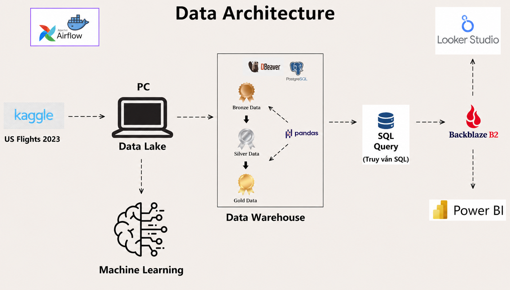

# US Flights 2023 – Data Warehouse & Analytics System

## 📌 Overview

This project delivers an **end-to-end analytical platform for U.S. domestic flights in 2023**.  
Starting from raw Kaggle datasets, we build an automated data pipeline, a dimensional data warehouse in PostgreSQL, and a final reporting layer in **Looker Studio**, with an additional machine‑learning extension that predicts departure delays.

The pipeline is orchestrated by **Apache Airflow** and follows a **Medallion Architecture** (Bronze → Silver → Gold) to guarantee data quality and traceability. All analytical queries are written in **SQL**, executed directly against the Gold layer via **DBeaver**, and their results are uploaded to **Backblaze B2** cloud storage before being visualised in Looker Studio.

On the predictive side, **11 machine learning and deep learning models** were trained and evaluated; **LightGBM** achieved the best balance between precision and recall (F1‑score **0.721**, ROC‑AUC **0.729**).

## 🧱 Architecture

The diagram above illustrates the complete flow:  
data is sourced from Kaggle and lands in a local **Data Lake**; **Apache Airflow** orchestrates the movement into **PostgreSQL** (Bronze → Silver → Gold); analysts write **SQL queries** via **DBeaver**; results are exported to **Backblaze B2** and finally visualised in **Looker Studio**.

- **Data source:** [2023 US Civil Flights, delays, meteo and aircraft](https://www.kaggle.com/datasets/bordanova/2023-us-civil-flights-delay-meteo-and-aircraft)
- **Warehouse:** PostgreSQL 15 (Docker)
- **Orchestration:** Apache Airflow
- **SQL client:** DBeaver
- **Cloud storage:** Backblaze B2 (S3‑compatible)
- **BI & Dashboarding:** Looker Studio

## 🔄 Data Pipeline – Medallion Architecture

The entire ETL process is automated by an Airflow DAG (`ETL_Pipeline`) and consists of three stages:

### Bronze Layer – Raw Data Ingestion
- All CSV files from Kaggle are loaded **without any transformation** into the `bronze` schema.
- This preserves the original data and allows full lineage tracking.

### Silver Layer – Cleaning & Integration
Performed with **Python (Pandas)** inside Airflow tasks:
- Removal of NULL values
- Data type standardisation (e.g., date columns to `DATE`)
- Deduplication
- Merging of `US_flights_2023` with `airports_geolocation` and weather data

The result is a single, clean table: `silver.us_flights_clean`.

### Gold Layer – Dimensional Model
- The clean data is modelled as a **Star Schema**:
  - **Fact table:** `Fact_flights` (departure/arrival delays, flight duration, distance type…)
  - **Dimension tables:**
    - `Dim_Date`
    - `Dim_Airline`
    - `Dim_Airport` (used for both departure and arrival)
    - `Dim_Plane`
- Dimensions are linked to the fact table via foreign keys.
- Loading is done via **SQL scripts** that Airflow executes, ensuring idempotency (`ON CONFLICT DO NOTHING`).

## 📊 Reporting and Visualisation

Instead of a heavy OLAP server (SSAS, Atoti, etc.), we adopt a **simple, SQL‑centric workflow**:

1. **Write SQL queries** on the Gold layer using **DBeaver**.
2. **Export** query results as CSV files.
3. **Upload** CSVs to **Backblaze B2** using a dedicated Python script.
4. **Import** the files into **Looker Studio** to build interactive dashboards.

Dashboards answer questions such as:
- Top‑10 airports with the highest average departure delay
- Average arrival delay by day of the week
- Flight counts per distance type, per state and city
- Carrier performance across weekdays
- And many more (20+ analytical queries)

## 🤖 Machine Learning – Departure Delay Prediction

In addition to descriptive analytics, we built several **ML/DL models** to predict whether a flight departs late (binary classification).

- **Target:** `Dep_Delay_Tag` (1 = delayed, 0 = not delayed)
- **Features:** Weather variables, aircraft age, time‑based features (month, day, weekend), airline, geographic coordinates, etc.
- **Split:** 60% train – 20% validation – 20% test

**Models evaluated:**
- Logistic Regression (from scratch and Scikit‑learn)
- HistGradientBoosting
- AdaBoost
- XGBoost
- LightGBM
- CatBoost
- Multi‑Layer Perceptron (Scikit‑learn)
- Neural Network, GRU, LSTM, BiLSTM (PyTorch)

### Results on the test set

| Model | Accuracy | F1‑Score | ROC‑AUC |
|-------|----------|----------|---------|
| **LightGBM** | 0.6935 | **0.7210** | **0.7292** |
| CatBoost | 0.6928 | 0.7202 | 0.7248 |
| XGBoost | **0.6981** | 0.7185 | 0.7215 |
| MLP (Scikit‑learn) | 0.6744 | 0.6889 | 0.6987 |
| GRU (PyTorch) | 0.6610 | 0.6353 | 0.6893 |

**LightGBM** was selected as the final model because it offers the **highest F1‑score and ROC‑AUC**, i.e. the best overall classification performance and discrimination ability.

## 🛠️ Technology Stack

| Category | Tools |
|----------|-------|
| **Orchestration** | Apache Airflow |
| **Database** | PostgreSQL 15 (Docker) |
| **Data Processing** | Python (Pandas, NumPy, psycopg2) |
| **Data Storage** | Backblaze B2 (cloud), local Parquet/CSV |
| **SQL Client** | DBeaver |
| **BI & Dashboard** | Looker Studio |
| **Machine Learning** | Scikit‑learn, LightGBM, XGBoost, CatBoost |
| **Deep Learning** | PyTorch |
| **Infrastructure** | Docker, Docker Compose |

## 📁 Repository Structure
