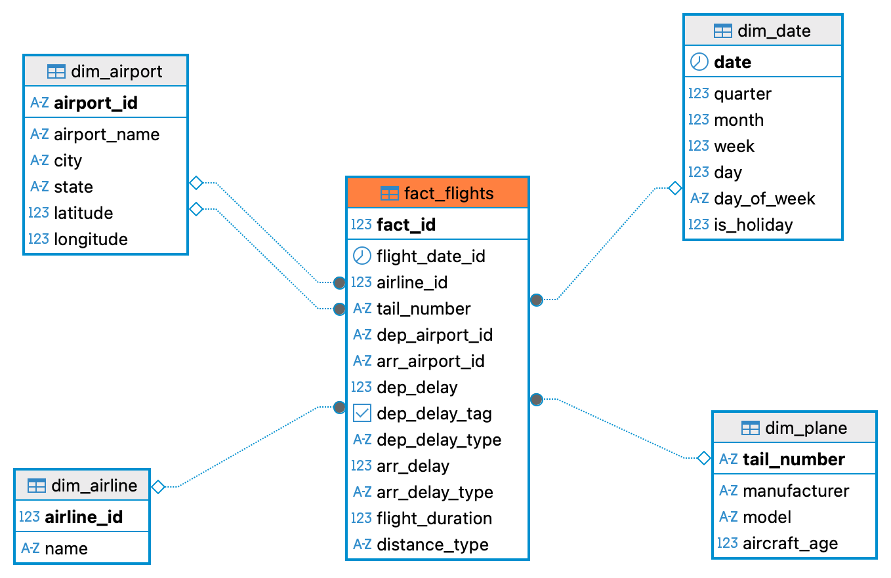

# US Flights 2023 – Data Warehouse & Analytics System

## 📌 Overview

This project builds a **complete analytical system** for domestic US flights in 2023, from raw CSV data to interactive dashboards and delay prediction models.

The pipeline follows a **Medallion Architecture** (Bronze → Silver → Gold) implemented on **PostgreSQL**, orchestrated by **Apache Airflow**.  
All analytical queries are written in **SQL** and executed directly against the Gold layer using **DBeaver**. Results are exported as CSV files, uploaded to **Backblaze B2** cloud storage, and finally visualized in **Power BI** and **Looker Studio**.

The project also includes a **Machine Learning** component that predicts flight departure delays using multiple models, with **LightGBM** achieving the best performance.

## 🧱 Architecture

- **Data source:** [Kaggle: 2023 US Civil Flights, delays, meteo and aircraft](https://www.kaggle.com/datasets/bordanova/2023-us-civil-flights-delay-meteo-and-aircraft)
- **Data warehouse:** PostgreSQL 15 inside a Docker container
- **Orchestration:** Apache Airflow (local installation)
- **Database client:** DBeaver for SQL queries
- **Cloud storage:** Backblaze B2 (S3-compatible)
- **BI tools:** Microsoft Power BI, Google Looker Studio
- **ML framework:** Scikit-learn, PyTorch, LightGBM, XGBoost, CatBoost

## 🔄 Data Pipeline (Medallion Architecture)

### 1. Bronze Layer (Raw Data Ingestion)
- 5 CSV files from Kaggle are loaded **as-is** into schema `bronze`.
- No transformations are applied – this layer guarantees data lineage and reproducibility.

### 2. Silver Layer (Cleaning & Integration)
Performed with **Python (Pandas)** via Airflow tasks:
- Drop rows with NULL values
- Standardize data types (e.g., convert date columns to `DATE`)
- Remove duplicate records
- Merge `US_flights_2023` with `airports_geolocation` and other auxiliary tables

The result is a single clean table: `silver.us_flights_clean`.

### 3. Gold Layer (Star Schema)
- Data is modeled into a **Star Schema** optimized for analytical queries:
  - **Fact table:** `Fact_flights` – departure delay, arrival delay, flight duration, etc.
  - **Dimension tables:**
    - `Dim_Date`
    - `Dim_Airline`
    - `Dim_Airport`
    - `Dim_Plane`
- All dimension keys are linked to the fact table via foreign keys.
- This layer is loaded using **SQL stored procedures** called by Airflow.

## 📊 Reporting & Visualization Workflow

The project deliberately avoids heavyweight OLAP servers like SSAS. Instead, we use a straightforward and modern approach:

1. **SQL queries** written and run in **DBeaver** directly against the Gold layer.
2. Query results are **exported as CSV files**.
3. CSV files are **uploaded to Backblaze B2** (a low-cost, S3-compatible cloud storage).
4. Files are downloaded locally and **imported into Power BI** and **Looker Studio**.
5. Interactive dashboards are built to explore:
   - Top 10 airports by average departure delay
   - Average delay by day of week and airline
   - Flight count by distance type and state
   - And many more (20+ pre-defined analyses)

## 🤖 Machine Learning – Departure Delay Prediction

Beyond descriptive analytics, we built several ML/DL models to predict whether a flight will be delayed (binary classification).

- **Target variable:** `Dep_Delay_Tag` (1 = delayed, 0 = not delayed)
- **Features:** weather data, aircraft age, time features, airline, route, etc.
- **Data split:** 60% train, 20% dev, 20% test
- **Models trained:**
  - *Machine Learning:* Logistic Regression (from scratch & Scikit-learn), HistGradientBoosting, AdaBoost, XGBoost, LightGBM, CatBoost
  - *Deep Learning:* MLP, Neural Network (PyTorch), GRU, LSTM, BiLSTM

| Model | Accuracy | F1-Score | ROC-AUC |
|-------|----------|----------|---------|
| **LightGBM** | 0.6935 | **0.7210** | **0.7292** |
| CatBoost | 0.6928 | 0.7202 | 0.7248 |
| XGBoost | **0.6981** | 0.7185 | 0.7215 |
| MLP (Scikit-learn) | 0.6744 | 0.6889 | 0.6987 |

> **LightGBM** was selected as the final model due to its highest F1-score and ROC-AUC, providing the best balance between precision and recall.

## 🚀 Setup & Usage

### Prerequisites
- Docker Desktop
- Python 3.10+
- DBeaver (or any PostgreSQL client)
- [Kaggle dataset](https://www.kaggle.com/datasets/bordanova/2023-us-civil-flights-delay-meteo-and-aircraft)

├── ETL_pipeline/
│   ├── airflow/                     # Airflow DAGs and config
│   ├── etl_pipeline/                # Python code for bronze/silver/gold
│   │   ├── bronze_layer/
│   │   ├── silver_layer/
│   │   └── gold_layer/
│   ├── SQL/                         # DDL scripts
│   ├── docker-compose.yaml
│   └── requirements.txt
├── Data Mining Project/
│   ├── EDA/                         # Exploratory Data Analysis notebooks
│   ├── Preprocessing/               # Data cleaning & feature engineering
│   ├── Kiểm định/                   # Hypothesis testing
│   ├── Machine Learning/            # ML model scripts
│   └── Deep Learning/               # DL model scripts (PyTorch)
├── Report/                          # Full project report (PDF)
├── star_schema_data_warehouse.png
└── README.md

